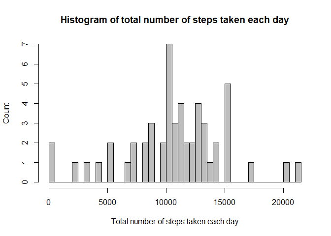
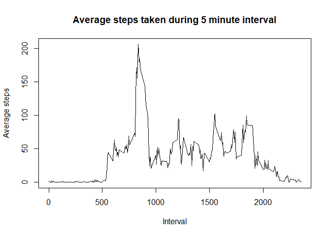
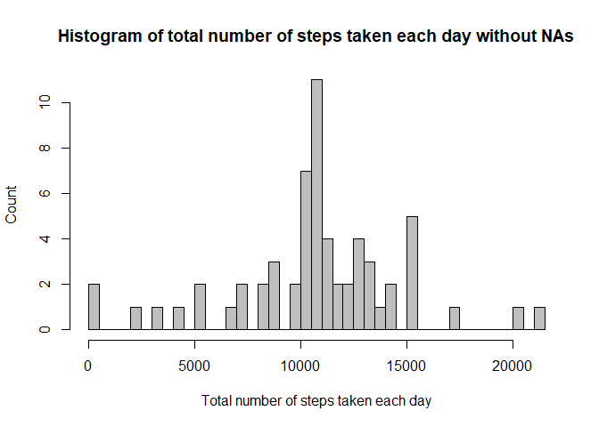
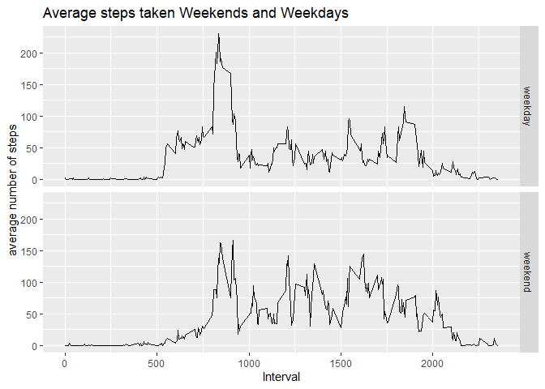

## Activity monitoring data assignment
 
#### Loading and preprocessing the data
 
Setting working directory

```r
setwd("~/repdata_data_activity")
```

Load the data and format the date as YY-MM-DD

```r
Activity <- read.csv("activity.csv", na.strings = "NA")
Activity$date <- as.Date(Activity$date, format = c("%Y-%m-%d"))
```

#### What is mean total number of steps taken per day?

The total number of steps taken per day

```r
aggSteps <- aggregate(steps ~ date,Activity, sum)
```

A histogram of the total number of steps taken each day

```r
hist(aggSteps$steps, 
     breaks=length(aggSteps$date), 
     col="grey", 
     xlab="Total number of steps taken each day", 
     ylab="Count", 
     main="Histogram of total number of steps taken each day")
```

<!-- -->

Calculating the mean and median of the total number of steps taken per day

```r
meanSteps <- mean(aggSteps$steps) ## mean is 10766.19 steps
meadianSteps <- median(aggSteps$steps) ## median is 10765 steps
```
The mean is 1.0766189\times 10^{4} and the median is 10765.

#### What is the average daily activity pattern?

Calculating average number of steps taken, averaged across all days

```r
library(dplyr)
```

```
## 
## Attaching package: 'dplyr'
```

```
## The following objects are masked from 'package:stats':
## 
##     filter, lag
```

```
## The following objects are masked from 'package:base':
## 
##     intersect, setdiff, setequal, union
```

```r
ADAP <- na.omit(Activity) %>% 
  group_by(interval) %>% 
  summarize(AverageSteps=mean(steps))
```

A time series plot of the 5-minute interval (x-axis) and the average number of steps taken, averaged across all days (y-axis).

```r
plot(ADAP$interval, ADAP$AverageSteps, 
     type="l",
     xlab="Interval",
     ylab="Average steps",
     main="Average steps taken during 5 minute interval")
```

<!-- -->

*Which 5-minute interval, on average across all the days in the dataset, contains the maximum number of steps?*

```r
MaxInterval <- ADAP [which.max(ADAP$AverageSteps), 1]
```
The highest average step count happened during interval 835.

#### Imputing missing values

Calculating the total number of missing values in the dataset

```r
TotalNA <- sum(is.na(Activity$steps))
```
The total number of missing values is 2304.

To fill in the NAs, we will take the average number of steps during that 5 minute interval over all days and assign it to that particular NA.


```r
fillNA <- Activity
for (i in 1:nrow(fillNA)) {
  if (is.na(fillNA$steps[i])) {
    # Find the index value for when the interval matches the average
    ndx <- which(fillNA$interval[i] == ADAP$interval)
    # Assign the value to replace the NA
    fillNA$steps[i] <- ADAP[ndx,]$AverageSteps
  }
}
```


Recalculating total number of steps taken each day 

```r
aggStepsNA <- aggregate(steps ~ date,fillNA, sum)
```

A histogram of the total number of steps taken each day 

```r
hist(aggStepsNA$steps, 
     breaks=length(aggStepsNA$date), 
     col="grey", 
     xlab="Total number of steps taken each day", 
     ylab="Count", 
     main="Histogram of total number of steps taken each day without NAs")
```

<!-- -->

Calculating the mean and median total number of steps taken per day. 

```r
meanStepsNA <- mean(aggStepsNA$steps) 
meadianStepsNA <- median(aggStepsNA$steps)
```
The mean is 1.0766189\times 10^{4} and the median is 1.0766189\times 10^{4}.

*Do these values differ from the estimates from the first part of the assignment?*
The mean is unchanged, but the median moved slightly and is now equal to the mean.

*What is the impact of imputing missing data on the estimates of the total daily number of steps?*
Inputting missing data based on an average leaves the average daily total number of steps the same while changing the median.

#### Are there differences in activity patterns between weekdays and weekends?

Creating a new factor variable (weekday) with two levels – “weekday” and “weekend” indicating whether a given date is a weekday or weekend day.

```r
Sys.setlocale("LC_TIME", "C")
```

```
## [1] "C"
```

```r
ActivityWD <- fillNA %>%
  mutate (weekdays=weekdays (fillNA$date, abbreviate=TRUE)) %>%
  mutate(weekdays = recode_factor(weekdays,
                                  "Mon" = "weekday",
                                  "Tue" = "weekday",
                                  "Wed" = "weekday",
                                  "Thu" = "weekday",
                                  "Fri" = "weekday",
                                  "Sat" = "weekend",
                                  "Sun" = "weekend")) %>%
  group_by(weekdays, interval) %>%
  summarize(AverageSteps=mean(steps))
```

A panel plot containing a time series plot of the 5-minute interval (x-axis) and the average number of steps taken, averaged across all weekday days or weekend days (y-axis). 

```r
library(ggplot2)
qplot (interval,AverageSteps,data=ActivityWD, 
       geom="line",
       xlab="Interval",
       ylab="average number of steps",
       main="Average steps taken Weekends and Weekdays",
       facets=weekdays~.)
```

<!-- -->

Activity looks quiet close to each other on weekdays and on weekends, but there is earlier activity on weekdays.


